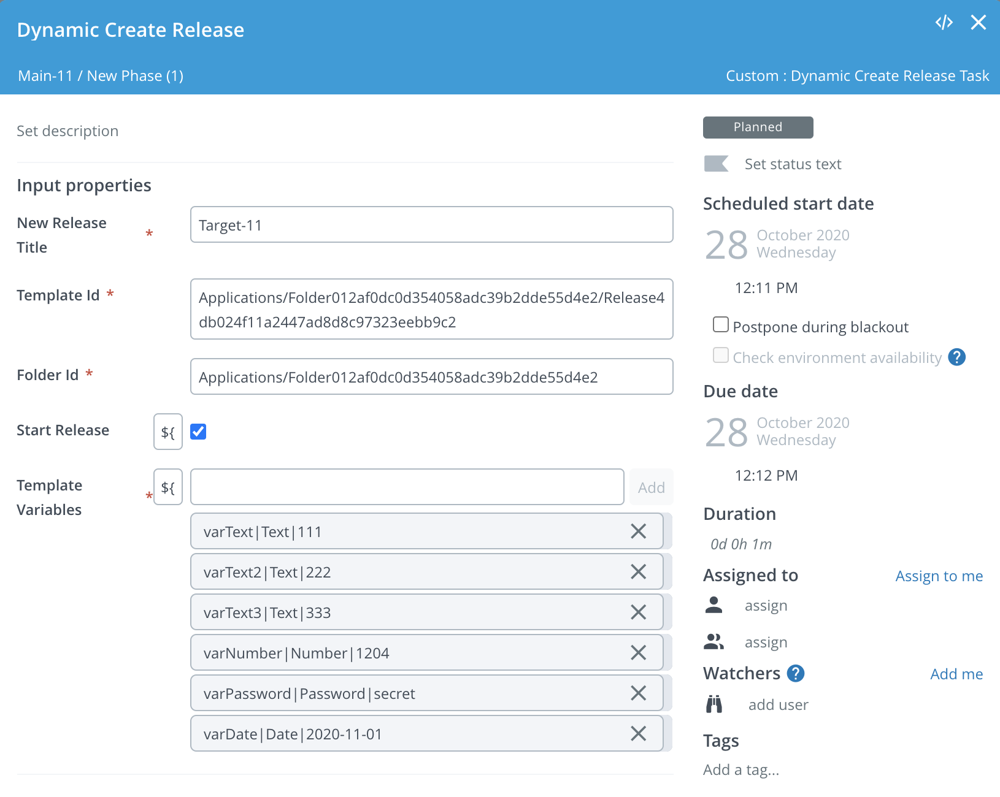

# XL Release Dynamic Create Release Task plugin

## Preface

This document describes the functionality provided by the XL Release Dynamic Create Release Task plugin.

See the [XL Release reference manual](https://docs.xebialabs.com/xl-release) for background information on XL Release and release automation concepts.  

## Overview

## Requirements

* XL Release 9.7.0

## Installation

* Copy the latest JAR file from the [releases page](https://github.com/xebialabs-community/xlr-dynamic-create-release-task-plugin/releases) into the `XL_RELEASE_SERVER/plugins/__local__` directory.
* Restart the XL Release server.

## Features/Usage/Types/Tasks

Provides a task that will add a Create Release Task.  The vertical-bar delimiter and the date format can be customized in the synthetic.xml file.

## References

